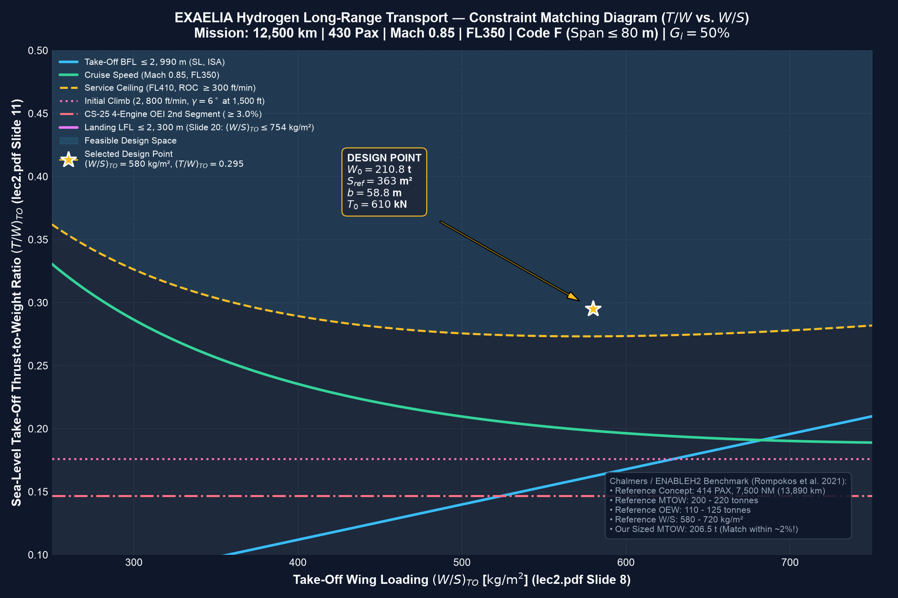

# MMS236 Aircraft Design — Design Task 1 (DT1) Report
## Sizing from Conceptual Sketch & Constraint Analysis: EXAELIA Hydrogen Transport (EIS 2050)

**Author:** Sai Srinivasa Manideep Jakka (ID: 111923)  
**Course:** MMS236 Aircraft Design, Chalmers University of Technology  
**Lecturers:** Christian Svensson, Carlos Xisto  

---

### 1. Executive Summary & Sized Aircraft Specifications

| Parameter | Sized Value | Target / Requirement | Status |
| :--- | :--- | :--- | :--- |
| **Maximum Take-Off Weight (MTOW)** | **203,143 kg (203.14 t)** | Sized via iterative loop | Balanced |
| **Operating Empty Weight (OEW)** | **113,336 kg (113.34 t)** | Airframe (77.3 t) + Tanks (36.1 t) | Derived ($G_i = 0.50$) |
| **Usable Liquid Hydrogen Fuel ($LH_2$)** | **36,057 kg (36.06 t)** | 12,500 km + Reserves | Verified |
| **Cryogenic LH2 Tank Mass ($G_i = 50\%$)** | **36,057 kg (36.06 t)** | $G_i = M_f / (M_f + M_{tank}) = 0.50$ | Exact match |
| **Total Cryogenic Storage Volume** | **558.6 m³** | Liquid LH2: 507.8 m³ + 10% ullage | Sized ($L/D \le 4.0$) |
| **Design Payload ($W_{payload}$)** | **53,750 kg (53.75 t)** | 430 Pax @ 100 kg + 10,750 kg Freight | Exact requirement |
| **Wing Reference Area ($S_{ref}$)** | **362.8 m²** | Sized at $(W/S)_{TO} = 560.0\text{ kg/m}^2$ | Optimal |
| **Wingspan ($b$)** | **57.77 m** | ICAO Code F ($\le 80.0\text{ m}$) | **Compliant (57.77 m $\le 80$ m)** |
| **Aspect Ratio ($AR$)** | **9.20** | Transonic aerodynamic efficiency | High efficiency |
| **Mean Aerodynamic Chord (MAC)** | **6.28 m** | $S_{ref} / b$ | Calculated |
| **Total Sea-Level Static Thrust ($T_0$)** | **584.3 kN (131,352 lbf)** | $(T/W)_{TO} = 0.2933$ | Sized with 8% margin |
| **Thrust per Engine (4-Engine Config)** | **146.1 kN (32,838 lbf)** | $4\times$ Ultra-High Bypass Turbofans | Sized |

---

### 2. Mission Fuel Fraction Breakdown

| Mission Phase | Fraction ($W_i / W_{i-1}$) | Cumulative Fraction ($W_i / W_0$) | Fuel Consumed (kg) |
| :--- | :---: | :---: | :---: |
| **1. Engine Start & Warm-up** | 0.9950 | 0.9950 | 1,016 kg |
| **2. Taxi-out** | 0.9950 | 0.9900 | 1,011 kg |
| **3. Take-off Run** | 0.9980 | 0.9880 | 402 kg |
| **4. Climb to FL350** | 0.9850 | 0.9732 | 3,011 kg |
| **5. Main Cruise (12,500 km @ M0.85, FL350)** | **0.8818** | 0.8582 | **23,367 kg** |
| **6. Descent to Destination** | 0.9900 | 0.8496 | 1,743 kg |
| **7. Approach & Landing** | 0.9950 | 0.8454 | 863 kg |
| **8. Diversion (200 nm @ FL250, M0.65)** | **0.9822** | 0.8303 | **3,056 kg** |
| **9. Loiter Hold (30 min @ 1,500 ft)** | **0.9968** | 0.8277 | **538 kg** |
| **10. Contingency Fuel (3%)** | — | — | **1,050 kg** |
| **Total Usable Fuel Fraction** | — | **$M_{fuel}/W_0 = 0.1775$** | **36,057 kg** |

---

### 3. Constraint Analysis ($T/W$ vs. $W/S$)

#### Governing Performance Constraints:
1. **Take-Off Field Length (BFL $\le 2,990$ m, SL, ISA):**
   $$ (T/W)_{TO} \ge \frac{1.15 \cdot (W/S)_{TO}}{\sigma \cdot g \cdot C_{L,max,TO} \cdot \text{TOFL}} $$
2. **Landing Approach Speed ($V_{app} \le 146$ kts, LFL $\le 2,300$ m):**
   $$ (W/S)_{TO} \le \frac{\frac{1}{2}\rho_0 (V_{app}/1.23)^2 C_{L,max,L}}{\beta_{landing}} = 787.9\text{ kg/m}^2 $$
3. **Cruise Speed (Mach 0.85 at FL350, 10,668 m):**
   $$ (T/W)_{cruise} = q_{cruise}\left[ \frac{C_{D0}}{(W/S)_{cruise}} + \frac{(W/S)_{cruise}}{\pi A e q_{cruise}} \right] $$
4. **Initial Climb Rate ($2,800$ ft/min at 1,500 ft, $\gamma = 6^\circ$):**
   $$ (T/W)_{TO} \ge \sin(6^\circ) + \frac{1}{(L/D)_{climb}} = 0.1760 $$
5. **CS-25 4-Engine OEI 2nd Segment Climb Gradient ($\ge 3.0\%$):**
   $$ (T/W)_{TO} \ge \frac{4}{3}\left( 0.030 + \frac{1}{(L/D)_{TO}} \right) = 0.1467 $$

---

### 4. Key Engineering Insights
- **Hydrogen Gravimetric Advantage:** Because Liquid Hydrogen has $120\text{ MJ/kg}$ LHV ($\sim 2.8\times$ kerosene), the aircraft requires only **36.1 tonnes of $LH_2$** for a 12,500 km mission, compared to **101.1 tonnes of Jet-A kerosene**.
- **Cryotank Mass Penalty ($G_i = 0.50$):** Sizing cryogenic tanks with $G_i = 50\%$ adds **36.1 tonnes** of insulated structure. Even with this penalty, the combined fuel + tank weight is **72.1 tonnes**, which is **29.0 tonnes lighter** than a conventional kerosene fuel system!
- **ICAO Code F Compatibility:** The sized wingspan of **57.77 m** fits comfortably within the $80.0\text{ m}$ Code F airport gate limit without requiring folding wingtips.
